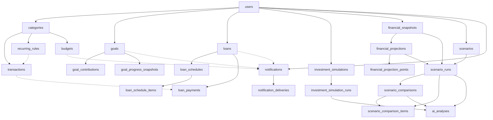

# SpendWise AI: Phase 1 Database Validation & Implementation Report

*PostgreSQL → SQLAlchemy 2.x → Alembic → validated database. No API, frontend or finance-engine code was written in this phase.*

**Result.** 31 tables, 25 ENUMs, 56 foreign keys, 142 CHECK constraints, 128 indexes (including PK/unique), 7 trigger functions / 40 triggers, 1 view. The Alembic migration builds the schema on an empty PostgreSQL 16 database, matches the reviewed reference DDL exactly (0 differences across 950 catalog rows), and **72 database tests pass**. Validation found **four real defects** (one of them silently disabling auditability), all fixed and covered by regression tests (Section 8).

---

## 1. Step 1: Schema validation (18 areas)

| # | Area | Finding | Action |
|---|---|---|---|
| 1 | Missing tables | None missing for the finalized architecture. Considered and rejected: a `monthly_summaries` table (computed on demand; the result lives in notifications/AI records), an EAV `scenario_assumptions` table (weak typing; JSONB + required-key CHECK is stronger), child tables for twin state (immutable JSONB + typed summary columns is sufficient) | none |
| 2 | Relationships | A run was not tied to its scenario's type, nor were its projections tied to the same snapshot, kind and horizon | `scenario_type` pinned in the run FK; projections FK'd on `(id,user_id,snapshot_id)`; kind/horizon trigger |
| 3 | Foreign keys | `refresh_tokens.replaced_by_id` was not owner-scoped | composite self-FK `(replaced_by_id, user_id)` |
| 4 | ON DELETE | Deleting a **user** failed (protective FKs fired before the cascade finished); run-cleanup trigger would fail on shared projections; comparisons could be left with < 2 items | protective FKs deferred; cleanup rewritten; comparisons removed with their runs |
| 5 | Ownership | Every table has `user_id` or a composite FK carrying it; verified by a catalog test | none |
| 6 | Indexes | 9 FK-support indexes missing (budgets, recurring_rules, notifications ×3, loan_payments, comparisons ×2, refresh_tokens) | added |
| 7 | Unique constraints | Needed: scenario type pin, comparability keys, per-snapshot projection key | added |
| 8 | CHECK constraints | Needed: transaction date range, run horizon = frozen assumption, comparison item count (2-3) | added (CHECK + deferred constraint triggers) |
| 9 | ENUMs | 25 enums; closed, stable vocabularies. `engine_version` is deliberately **not** an enum (it grows every release): `varchar` + semver CHECK. `goal_type`/`loan_type` follow the specification and can be extended with `ALTER TYPE … ADD VALUE` | none |
| 10 | Currency | `CHAR(3)` FK to `currencies`, **no default in any financial table**; composite FKs force a child to share its parent's currency; symbols exist only in reference data; USD/EUR/GBP rows tested | added minor-unit trigger |
| 11 | Decimal precision | See 1.1 | none |
| 12 | Timestamps | All timestamps are `timestamptz` (test asserts none are `timestamp`); business dates are `date`; `updated_at` maintained by trigger, not the client | none |
| 13 | Reproducibility | Immutable runs store frozen assumptions, snapshot, engine version, input hash, result; same inputs + version cannot create a duplicate | none |
| 14 | Versioning | `engine_version` semver CHECK on every result table; `*_schema_version` for JSONB payloads | none |
| 15 | Digital Twin | Immutable snapshots, baseline/scenario projections with monthly points; baselines shared across runs | none |
| 16 | AI storage | Sanitized context, hash, prompt/model versions, validation status, token/latency metadata; no raw prompt, no PII; exactly one source | none |
| 17 | Notifications | Idempotent `dedupe_key`, per-channel deliveries, preferences, optional links `SET NULL (col)` | none |
| 18 | Auditability | Result tables immutable (trigger), `audit_log` append-only by privilege | **trigger bug fixed** (Section 8) |

### 1.1 Money and numeric precision

| Kind | Type | Why |
|---|---|---|
| Amounts (38 columns) | `NUMERIC(18,4)` | Exact decimal arithmetic: `0.1 + 0.2 = 0.3` (tested; floats give 0.30000000000000004). 14 integer digits comfortably exceeds any personal-finance value, including loan principals and 60-year projections. 4 decimals hold intermediate engine precision and currencies with up to 3 minor units. |
| User-entered amounts | same type + `enforce_minor_units` trigger | A user cannot store 10.005 INR: scale is capped at `currencies.minor_units`. Engine outputs keep 4 dp. |
| Rates and ratios | `NUMERIC(9,6)` | Stored as fractions (0.095 = 9.5%); 6 dp resolves 0.0001%. |
| Thresholds | `NUMERIC(5,4)` | Fractions in (0,1]. |
| Never used | `real`, `double precision`, `money` | `money` is locale-bound and fixed-scale. A test fails the build if any such column appears. |

SQLAlchemy returns `Decimal` for every amount (tested round-trip at 99,999,999,999,999.99). In JSON payloads (assumptions/results) amounts and rates are decimal **strings**.

---

## 2. Step 2: Four-layer architecture check

| Layer | Stored in the database | Tables | Formulas in DB? |
|---|---|---|---|
| **A. Calculation Engine** | Inputs, results, `calc_type`, `engine_version`, `inputs_hash` for engine outputs that must persist | `loan_schedules`, `loan_schedule_items`, `goal_progress_snapshots`, `investment_simulation_runs` | No |
| **B. Scenario Simulation Engine** | Editable definitions; immutable runs (frozen assumptions, snapshot, version, hash, result); 2-3 way comparisons with a DB-enforced comparability key | `scenarios`, `scenario_runs`, `scenario_comparisons`, `scenario_comparison_items` | No |
| **C. Financial Digital Twin** | Immutable snapshots; baseline and scenario projections; month-by-month projected states | `financial_snapshots`, `financial_projections`, `financial_projection_points` | No |
| **D. AI Analysis Layer** | Sanitized context, hash, prompt/model/provider, validated output, validation status | `ai_analyses` | No |

The only arithmetic in the database is two integrity checks that verify stored engine output (`payment = principal + interest` on schedule rows) and a ledger sum (`v_goal_current_amounts` = starting amount + signed contributions). No interest, discounting, compounding or projection logic exists in SQL or in the models. The only computed figures in the repo are the pre-computed, hand-typed seed loan fixture, which is labelled as such.

---

## 3. Step 3: ER diagram

### 3.1 Relationship overview



Solid arrows are ownership/parent-child foreign keys; dotted arrows are optional or secondary links. Every box also carries `user_id`, and every child FK includes it (composite FK), so a link can never cross users. Reading top to bottom: **User** owns **financial data** (categories → transactions, recurring rules, budgets), **goals** (ledger + progress snapshots), **loans** (schedules, payments linked to expense transactions), **investment simulations** (runs), **scenarios**, and a **Digital Twin** (snapshots → projections → monthly points). A scenario run binds a snapshot and two projections; comparisons bind 2-3 runs of the same snapshot/currency/horizon; **AI analyses** attach to a run, a comparison or an investment run; notifications optionally point at goals, loans and budgets.

### 3.2 Complete ER diagram (all 232 lines; key columns shown, every column is in the data dictionary)

```mermaid
erDiagram
    ai_analyses {
        uuid id PK
        uuid user_id FK
        uuid scenario_run_id FK
        uuid comparison_id FK
        uuid investment_simulation_run_id FK
    }
    audit_log {
        bigint id PK
        uuid user_id FK
    }
    auth_tokens {
        uuid id PK
        uuid user_id FK
        char_64 token_hash UK
    }
    budgets {
        uuid id PK
        uuid user_id FK
        uuid category_id FK
        txn_kind category_kind FK
        char_3 currency FK
    }
    categories {
        uuid id PK
        uuid user_id FK
    }
    currencies {
        char_3 code PK
    }
    financial_projection_points {
        uuid projection_id PK, FK
        smallint month_index PK
        uuid user_id FK
    }
    financial_projections {
        uuid id PK
        uuid user_id FK
        uuid snapshot_id FK
        char_3 currency FK
    }
    financial_snapshots {
        uuid id PK
        uuid user_id FK
        char_3 currency FK
    }
    goal_contributions {
        uuid id PK
        uuid goal_id FK
        uuid user_id FK
        char_3 currency FK
    }
    goal_progress_snapshots {
        uuid id PK
        uuid goal_id FK
        uuid user_id FK
        char_3 currency FK
    }
    goals {
        uuid id PK
        uuid user_id FK
        char_3 currency FK
    }
    investment_simulation_runs {
        uuid id PK
        uuid user_id FK
        uuid simulation_id FK
        char_3 currency FK
    }
    investment_simulations {
        uuid id PK
        uuid user_id FK
        char_3 currency FK
    }
    loan_payments {
        uuid id PK
        uuid loan_id FK
        uuid user_id FK
        char_3 currency FK
        uuid transaction_id FK
    }
    loan_schedule_items {
        uuid schedule_id PK, FK
        integer installment_number PK
        uuid user_id FK
    }
    loan_schedules {
        uuid id PK
        uuid loan_id FK
        uuid user_id FK
        char_3 currency FK
    }
    loans {
        uuid id PK
        uuid user_id FK
        char_3 currency FK
    }
    notification_deliveries {
        uuid id PK
        uuid notification_id FK
        uuid user_id FK
    }
    notification_preferences {
        uuid user_id PK, FK
        notification_type notification_type PK
    }
    notifications {
        uuid id PK
        uuid user_id FK
        uuid goal_id FK
        uuid loan_id FK
        uuid budget_id FK
    }
    recurring_rules {
        uuid id PK
        uuid user_id FK
        uuid category_id FK
        txn_kind kind FK
        char_3 currency FK
    }
    refresh_tokens {
        uuid id PK
        uuid user_id FK
        char_64 token_hash UK
        uuid replaced_by_id FK
    }
    scenario_comparison_items {
        uuid comparison_id PK, FK
        smallint position PK
        uuid user_id FK
        char_3 currency FK
        uuid snapshot_id FK
        integer horizon_months FK
        uuid scenario_run_id FK
    }
    scenario_comparisons {
        uuid id PK
        uuid user_id FK
        uuid snapshot_id FK
        char_3 currency FK
    }
    scenario_runs {
        uuid id PK
        uuid user_id FK
        uuid scenario_id FK
        uuid snapshot_id FK
        char_3 currency FK
        scenario_type scenario_type FK
        uuid baseline_projection_id FK
        uuid scenario_projection_id FK
    }
    scenarios {
        uuid id PK
        uuid user_id FK
        char_3 currency FK
    }
    transactions {
        uuid id PK
        uuid user_id FK
        uuid category_id FK
        txn_kind kind FK
        char_3 currency FK
        uuid recurring_rule_id FK
    }
    user_preferences {
        uuid user_id PK, FK
        char_3 base_currency FK
    }
    user_profiles {
        uuid user_id PK, FK
    }
    users {
        uuid id PK
        citext email UK
    }
    scenario_comparisons |o--o{ ai_analyses : "comparison_id"
    investment_simulation_runs |o--o{ ai_analyses : "investment_simulation_run_id"
    scenario_runs |o--o{ ai_analyses : "scenario_run_id"
    users ||--o{ ai_analyses : "user_id"
    users ||--o{ audit_log : "user_id"
    users ||--o{ auth_tokens : "user_id"
    categories ||--o{ budgets : "category_id"
    currencies ||--o{ budgets : "currency"
    users ||--o{ budgets : "user_id"
    users ||--o{ categories : "user_id"
    financial_projections ||--o{ financial_projection_points : "projection_id"
    financial_snapshots ||--o{ financial_projections : "snapshot_id"
    currencies ||--o{ financial_snapshots : "currency"
    users ||--o{ financial_snapshots : "user_id"
    goals ||--o{ goal_contributions : "goal_id"
    goals ||--o{ goal_progress_snapshots : "goal_id"
    currencies ||--o{ goals : "currency"
    users ||--o{ goals : "user_id"
    investment_simulations ||--o{ investment_simulation_runs : "simulation_id"
    currencies ||--o{ investment_simulations : "currency"
    users ||--o{ investment_simulations : "user_id"
    loans ||--o{ loan_payments : "loan_id"
    transactions |o--o{ loan_payments : "transaction_id"
    loan_schedules ||--o{ loan_schedule_items : "schedule_id"
    loans ||--o{ loan_schedules : "loan_id"
    currencies ||--o{ loans : "currency"
    users ||--o{ loans : "user_id"
    notifications ||--o{ notification_deliveries : "notification_id"
    users ||--o{ notification_preferences : "user_id"
    budgets |o--o{ notifications : "budget_id"
    goals |o--o{ notifications : "goal_id"
    loans |o--o{ notifications : "loan_id"
    users ||--o{ notifications : "user_id"
    categories ||--o{ recurring_rules : "category_id"
    currencies ||--o{ recurring_rules : "currency"
    users ||--o{ recurring_rules : "user_id"
    refresh_tokens |o--o{ refresh_tokens : "replaced_by_id"
    users ||--o{ refresh_tokens : "user_id"
    scenario_comparisons ||--o{ scenario_comparison_items : "comparison_id"
    scenario_runs ||--o{ scenario_comparison_items : "scenario_run_id"
    currencies ||--o{ scenario_comparisons : "currency"
    financial_snapshots ||--o{ scenario_comparisons : "snapshot_id"
    users ||--o{ scenario_comparisons : "user_id"
    financial_projections ||--o{ scenario_runs : "baseline_projection_id"
    scenarios ||--o{ scenario_runs : "scenario_id"
    financial_projections ||--o{ scenario_runs : "scenario_projection_id"
    financial_snapshots ||--o{ scenario_runs : "snapshot_id"
    currencies ||--o{ scenarios : "currency"
    users ||--o{ scenarios : "user_id"
    categories ||--o{ transactions : "category_id"
    currencies ||--o{ transactions : "currency"
    recurring_rules |o--o{ transactions : "recurring_rule_id"
    users ||--o{ transactions : "user_id"
    currencies ||--o{ user_preferences : "base_currency"
    users ||--o| user_preferences : "user_id"
    users ||--o| user_profiles : "user_id"
```



---

## 4. Step 4: SQLAlchemy 2.x model structure

```
backend/app/models/
├── __init__.py             imports every model (registers all 31 tables)
├── base.py                 DeclarativeBase, naming convention, Money/Rate/UuidPk types, mixins, named-CHECK helpers
├── enums.py                Python enums mirroring all 25 PostgreSQL ENUMs
├── currency.py             Currency
├── user.py                 User, UserProfile, UserPreference, RefreshToken, AuthToken
├── category.py             Category
├── transaction.py          Transaction, RecurringRule, Budget
├── goal.py                 Goal, GoalContribution, GoalProgressSnapshot
├── loan.py                 Loan, LoanSchedule, LoanScheduleItem, LoanPayment
├── investment.py           InvestmentSimulation, InvestmentSimulationRun
├── financial_snapshot.py   FinancialSnapshot, FinancialProjection, FinancialProjectionPoint
├── scenario.py             Scenario, ScenarioRun, ScenarioComparison, ScenarioComparisonItem
├── ai_analysis.py          AiAnalysis
├── notification.py         Notification, NotificationDelivery, NotificationPreference
└── audit.py                AuditLog
```

Design points: typed `Mapped[...]`/`mapped_column`; `Numeric(18,4)` → `Decimal`; `DateTime(timezone=True)`; PostgreSQL `UUID`, `JSONB`, `CITEXT`, `INET`, `ARRAY`; ENUMs bound with `create_type=False` (the migration owns type creation); every CHECK is named (naming convention `ck_<table>_<name>`), every FK/unique has an explicit name, longest identifier is 60 characters (limit 63). All 31 mappers configure with warnings treated as errors.

**Relationship policy.** Relationships over composite FKs are `viewonly=True`: they are for reading/navigation. Writes set FK columns explicitly, so `user_id` always comes from the authenticated principal and ORM cascades can never create cross-user links. Deletion behaviour is the database's (`passive` by design). User aggregates (`User.profile`, `User.preferences`) are the only writable relationships; there are deliberately no `User.transactions`-style collections, to prevent unscoped lazy loading.

---

## 5. Step 5: Alembic

```
backend/
├── alembic.ini                    URL comes from DATABASE_URL (never committed)
└── alembic/
    ├── env.py                     imports app.models; compare_type + compare_server_default
    ├── script.py.mako
    └── versions/
        └── 0001_initial_schema.py
```

`0001_initial_schema` was **autogenerated from the models** and then extended with the objects autogenerate cannot express, frozen as SQL inside the migration: extensions (`citext`, `pg_trgm`, `btree_gin`), 25 ENUMs, 7 functions, 24 triggers, the `v_goal_current_amounts` view and the 4-row currency seed. Upgrade order: extensions → enums → functions → tables/indexes/FKs/CHECKs → seed → view → triggers. Downgrade drops them in reverse (extensions are left installed on purpose).

**Evolution rules.** (a) `alembic check` proves models and migration agree on tables/columns/constraints/indexes, but it does **not** compare trigger or function bodies or CHECK expressions, so `backend/scripts/catalog_dump.py` (a normalized catalog dump) is included to diff a migrated database against the reference DDL in CI. (b) Adding an ENUM value needs `ALTER TYPE … ADD VALUE` inside `op.get_context().autocommit_block()`. (c) Changing a function needs `CREATE OR REPLACE FUNCTION` in a new revision; never edit `0001`.

---

## 6. Setup and seed instructions

```bash
cp .env.example .env                                   # set a local password
docker compose --env-file .env up -d db                # or any PostgreSQL 15+
cd backend && python -m venv .venv && . .venv/bin/activate
pip install -r requirements-dev.txt
export DATABASE_URL=postgresql+psycopg://spendwise:<password>@localhost:5432/spendwise
alembic upgrade head && alembic check                  # build + verify
python -m scripts.seed_dev                             # idempotent demo data
python -m scripts.seed_dev --reset                     # wipe demo users (full cascade) and re-seed
export TEST_ADMIN_URL=postgresql+psycopg://spendwise:<password>@localhost:5432/postgres
pytest -q                                              # 72 tests, builds a temp DB from the migration
```

**Seed contents** (all synthetic; accounts cannot log in): 2 users (the second proves isolation), 28 categories, 118 transactions over 6 months, 3 recurring rules, 3 budgets, 3 goals with a contribution ledger, 1 loan with a **hand-typed 6-instalment fixture schedule** and 2 payments, 1 investment-simulation definition, 1 snapshot (plain sums of seeded transactions), 3 laptop scenario definitions (buy now / EMI / save first), notifications and preferences. Scenario runs, projections and AI analyses are intentionally **not** seeded: they must come from the Phase 3+ engine, and their schema is exercised by the tests.

---

## 7. Validation results (PostgreSQL 16.15, native server)

| Check | Result |
|---|---|
| `alembic upgrade head` on an empty database | OK: 31 tables, view, 25 enums, 7 functions, 4 currencies |
| `alembic check` (models vs migrated DB) | "No new upgrade operations detected." |
| Catalog diff: migrated DB vs reference `spendwise_schema.sql` | **0 differences / 950 rows** (columns, constraints, indexes, enums, triggers, function hashes, view, seed) |
| `alembic downgrade base` then `upgrade head` | OK: 0 tables/enums/views left, re-applies cleanly (tested in the suite) |
| Offline SQL generation (`--sql`) | OK (32 `CREATE TABLE` including `alembic_version`) |
| Test suite | **72 passed** (migrations 10, integrity 28, scenarios/twin/AI 32, RLS + seed 2) |
| Seed: first run, second run, `--reset` | OK, idempotent; `--reset` deletes through the full cascade, 0 orphans |
| ER diagram syntax | Parsed successfully by the Mermaid 11 parser |

**What the tests prove:** exact `Decimal` round-trip and no float drift; no `real/double/money` columns; amounts overflow and minor-unit violations rejected; invalid ENUM/currency rejected; cross-user category, goal-contribution, loan-payment transaction, notification goal and refresh-token links rejected by foreign keys; transaction/category kind mismatch rejected; budgets only on own expense categories; USD/EUR/GBP work with no INR assumption; a run cannot reference another user's scenario/snapshot, a mismatched currency, a different scenario type, projections of another snapshot, swapped kinds or a different horizon; comparisons accept 2-3 items, reject a 4th, reject <2 at commit, and reject runs of a different snapshot/horizon/user; every result table rejects UPDATEs; only the permitted columns can change (`name`, `is_current`); deleting a run removes dependent comparisons and orphaned projections but keeps shared ones; deleting a scenario cascades to runs and AI analyses; deleting a **user** removes the whole graph across all modules while leaving other users untouched; AI records require the matching source and cannot attach to another user's run; `audit_log` survives user deletion anonymised; optional Row-Level Security isolates users (own rows only, no identity → no rows, cannot write as another user).

**Not validated here (be aware):** Docker Compose file (no Docker in the sandbox), PostgreSQL 15 and 17, concurrency/locking behaviour, performance at scale, and RLS with the real application role.

---

## 8. Changes to the original SQL schema

**Review changes (v1.0 → v1.1, before writing models)**
1. Added `enforce_minor_units()` trigger on 8 user-entered-amount tables.
2. `scenarios` unique key now includes `scenario_type`; `scenario_runs` FK pins it.
3. `financial_projections` gets `UNIQUE (id, user_id, snapshot_id)`; run→projection FKs include `snapshot_id`; new `check_run_projections` trigger (kind and horizon).
4. `scenario_runs` CHECK: typed `horizon_months` equals the frozen assumption.
5. Cleanup trigger replaced by `scenario_run_before_delete` (removes comparisons containing the run) and `scenario_run_after_delete` (deletes only projections no other run references).
6. Deferred constraint triggers enforce 2-3 comparison items at commit.
7. `refresh_tokens.replaced_by_id` made owner-scoped (composite FK).
8. Added 9 FK-support indexes; `transaction_date` range CHECK; simplified the comparison immutability trigger.

**Defects found by running the tests (fixed in the final schema, migration and models)**
9. **`enforce_immutable()` did nothing on 9 of 11 tables.** In a trigger declared without arguments `TG_ARGV` is `NULL`, so `jsonb - NULL` is `NULL` and the comparison never differed. It only worked for the two tables that passed arguments. Fixed with `COALESCE(TG_ARGV, ARRAY[]::text[])`; `test_every_immutable_table_rejects_updates` guards every immutable table.
10. **Deleting a user failed** because protective `NO ACTION` FKs (category/snapshot/projection/run references) can be checked before the cascade removes the referencing rows. Those 8 FKs are now `DEFERRABLE INITIALLY DEFERRED`: the "still in use" error appears at `COMMIT`, and deleting a user works.
11. **The optional RLS block tried to enable RLS on the view** `v_goal_current_amounts`; it now targets base tables only.
12. v1.0's cleanup trigger would have raised a foreign-key error when two runs shared a projection (found in review; regression test added).

---

## 9. Remaining database risks

1. **Deferred protective FKs raise at COMMIT.** The service layer must pre-check "in use" cases for friendly 409s and catch `IntegrityError` around `commit()`.
2. **JSONB is validated only structurally** (object type, required keys, hash/semver formats). Semantic validity depends on Pydantic models and the `*_schema_version` columns.
3. **Some cross-table consistency cannot be enforced in SQL:** a row's currency equalling the user's `base_currency`; snapshot typed summaries matching the `state` JSONB; schedule item sums matching header totals. These need service-layer checks and engine tests.
4. **Immutability is trigger-based.** A superuser/owner can disable triggers; the runtime role must not own tables. `DELETE` remains allowed (required for user deletion, retention).
5. **`audit_log` is append-only by privilege only** (a trigger would conflict with the `ON DELETE SET NULL` anonymisation), stores `ip_address` (personal data), and has no retention or partitioning yet.
6. **Projection volume:** up to ~1,440 point rows per run (720 months × 2). Needs a retention/cleanup policy for old runs.
7. **Drift detection gap:** `alembic check` ignores trigger/function/CHECK bodies; run the catalog diff in CI.
8. **PostgreSQL ≥ 15 is required** (`ON DELETE SET NULL (column)`); only 16 was tested. ENUM values cannot be dropped easily.
9. **Seed loan schedule is a hand-computed fixture** (engine version `0.0.0`), to be replaced by real engine output.
10. **`users.email` stays unique after soft-delete**, so re-registration needs a purge job or an anonymising rename.

---

## Appendix A: Final table list

| # | Table | Module | Purpose |
|---|---|---|---|
| 1 | `currencies` | Reference | Supported currencies (INR enabled; USD/EUR/GBP ready). Symbol is presentation metadata only. |
| 2 | `auth_tokens` | Users & auth | Single-use hashed tokens for email verification and password reset. |
| 3 | `refresh_tokens` | Users & auth | Hashed rotating refresh tokens with family id (reuse detection) and owner-scoped replacement link. |
| 4 | `user_preferences` | Users & auth | 1:1 preferences: base currency, locale, default assumptions that are copied into scenarios. |
| 5 | `user_profiles` | Users & auth | 1:1 profile: name, country, timezone. |
| 6 | `users` | Users & auth | Authentication identity: citext email, argon2id hash, lockout and soft-delete fields. Root of every ownership path. |
| 7 | `budgets` | Financial data | Monthly budget per expense category with optional alert threshold. |
| 8 | `categories` | Financial data | Per-user income/expense categories (defaults are copied per user at signup). |
| 9 | `recurring_rules` | Financial data | Recurring income/expense templates scanned by the scheduler. |
| 10 | `transactions` | Financial data | Income and expense records (kind must match the category kind). Soft-deletable. |
| 11 | `goal_contributions` | Goals | Ledger of deposits/withdrawals; current amount = starting amount + signed sum. |
| 12 | `goal_progress_snapshots` | Goals | Immutable periodic engine outputs (progress, required contribution, ETA) with inputs and version. |
| 13 | `goals` | Goals | User-entered goals (target, starting amount, planned contribution, date). No derived values stored. |
| 14 | `loan_payments` | Loans | Payments actually made; optional link to the matching expense transaction. |
| 15 | `loan_schedule_items` | Loans | Instalment rows (opening, payment, principal, interest, closing) of a schedule. |
| 16 | `loan_schedules` | Loans | Persisted amortization header: engine version, assumptions, hash, totals; one current schedule per loan. |
| 17 | `loans` | Loans | Actual loans (hypothetical loans live in scenario assumptions). |
| 18 | `investment_simulation_runs` | Investment simulations | Immutable results of a simulation: frozen assumptions, version, hash, result. |
| 19 | `investment_simulations` | Investment simulations | Educational simulation definition with explicit typed assumptions (not a holding). |
| 20 | `financial_projection_points` | Digital twin | Month-by-month projected financial state (signed cash flow/savings/net worth). |
| 21 | `financial_projections` | Digital twin | Projection header of a snapshot: 'baseline' (no decision) or 'scenario'; shareable and deduplicated. |
| 22 | `financial_snapshots` | Digital twin | Immutable 'Current Financial State': typed summary + full twin state JSONB. |
| 23 | `scenario_comparison_items` | Scenarios | Positions 1-3; composite FKs force a shared owner, currency, snapshot and horizon. |
| 24 | `scenario_comparisons` | Scenarios | Result of comparing 2-3 runs; only the name is editable. |
| 25 | `scenario_runs` | Scenarios | Immutable reproducible result: frozen assumptions, snapshot, engine version, input hash, result, projections. |
| 26 | `scenarios` | Scenarios | Editable what-if definition (type, currency, assumptions JSONB with required core keys). |
| 27 | `ai_analyses` | AI | Sanitized context, context hash, prompt/model versions, validated output and validation status. No raw prompt, no PII. |
| 28 | `notification_deliveries` | Notifications | Per-channel delivery state for the notification worker. |
| 29 | `notification_preferences` | Notifications | Per-user, per-type channel toggles and reminder lead days. |
| 30 | `notifications` | Notifications | In-app notifications with idempotent dedupe key and optional goal/loan/budget links. |
| 31 | `audit_log` | Audit | Append-only security/audit events (user_id anonymised on account deletion). |

## Appendix B: ENUM types

| Enum | Values |
|---|---|
| `ai_task` | explain_scenario, compare_scenarios, explain_investment, explain_concept, spending_patterns, monthly_summary, goal_insights |
| `ai_validation_status` | passed, failed_fallback_used, skipped |
| `audit_outcome` | success, denied, failure |
| `auth_token_purpose` | email_verification, password_reset |
| `calc_type` | emi, loan_amortization, present_value, future_value, compound_interest, sip, lump_sum, inflation_adjusted, savings_projection, opportunity_cost, goal_contribution, twin_projection, scenario_simulation, scenario_comparison |
| `contribution_frequency` | monthly, quarterly, half_yearly, yearly |
| `delivery_channel` | in_app, email |
| `delivery_status` | pending, sent, failed, skipped |
| `goal_entry_kind` | contribution, withdrawal |
| `goal_status` | active, completed, paused, cancelled |
| `goal_type` | emergency_fund, laptop, education, travel, car, other |
| `investment_type` | sip, lump_sum, sip_plus_lump_sum |
| `loan_payment_type` | emi, prepayment, fee |
| `loan_status` | active, paid_off, cancelled |
| `loan_type` | education, personal, vehicle, home, credit_card, other |
| `notification_severity` | info, warning, critical |
| `notification_type` | goal_reminder, budget_alert, emi_reminder, monthly_summary, system |
| `period_timing` | start_of_period, end_of_period |
| `projection_kind` | baseline, scenario |
| `recurrence_frequency` | daily, weekly, monthly, quarterly, yearly |
| `scenario_status` | draft, active, archived |
| `scenario_type` | purchase, loan, investment_plan, education_plan, trip_plan, savings_change, income_change, expense_change, custom |
| `snapshot_kind` | manual, scheduled, scenario_baseline |
| `txn_kind` | income, expense |
| `txn_source` | manual, recurring, import |

## Appendix C: Data dictionary (generated from the migrated database)

Columns, types, nullability, defaults, primary keys, foreign keys with ON DELETE behaviour, unique constraints, CHECK constraints, indexes and triggers for every table. 🔑 marks primary-key columns.

### `currencies`
*Reference. Supported currencies (INR enabled; USD/EUR/GBP ready). Symbol is presentation metadata only.*

| Column | Type | Null | Default |
|---|---|---|---|
| `code` 🔑 | character(3) | NOT NULL |  |
| `name` | character varying(60) | NOT NULL |  |
| `symbol` | character varying(8) | NOT NULL |  |
| `minor_units` | smallint | NOT NULL |  |
| `default_locale` | character varying(16) | NOT NULL |  |
| `is_enabled` | boolean | NOT NULL | `false` |

**Primary key:** `code`

**CHECK constraints**

- `ck_currencies_code_format`: `((code ~ '^[A-Z]{3}$'::text))`
- `ck_currencies_minor_units_range`: `(((minor_units >= 0) AND (minor_units <= 4)))`

### `auth_tokens`
*Users & auth. Single-use hashed tokens for email verification and password reset.*

| Column | Type | Null | Default |
|---|---|---|---|
| `id` 🔑 | uuid | NOT NULL | `gen_random_uuid()` |
| `user_id` | uuid | NOT NULL |  |
| `purpose` | auth_token_purpose | NOT NULL |  |
| `token_hash` | character(64) | NOT NULL |  |
| `expires_at` | timestamp with time zone | NOT NULL |  |
| `used_at` | timestamp with time zone | null |  |
| `created_at` | timestamp with time zone | NOT NULL | `now()` |

**Primary key:** `id`

**Foreign keys**

- `(user_id)` → `users(id)` ON DELETE CASCADE

**Unique constraints**

- `uq_auth_tokens_token_hash`: (token_hash)

**CHECK constraints**

- `ck_auth_tokens_token_hash_hex64`: `((token_hash ~ '^[0-9a-f]{64}$'::text))`

**Other indexes**

- `ix_auth_tokens_user_purpose` USING btree (user_id, purpose)

### `refresh_tokens`
*Users & auth. Hashed rotating refresh tokens with family id (reuse detection) and owner-scoped replacement link.*

| Column | Type | Null | Default |
|---|---|---|---|
| `id` 🔑 | uuid | NOT NULL | `gen_random_uuid()` |
| `user_id` | uuid | NOT NULL |  |
| `family_id` | uuid | NOT NULL |  |
| `token_hash` | character(64) | NOT NULL |  |
| `issued_at` | timestamp with time zone | NOT NULL | `now()` |
| `expires_at` | timestamp with time zone | NOT NULL |  |
| `last_used_at` | timestamp with time zone | null |  |
| `revoked_at` | timestamp with time zone | null |  |
| `replaced_by_id` | uuid | null |  |

**Primary key:** `id`

**Foreign keys**

- `(replaced_by_id, user_id)` → `refresh_tokens(id, user_id)` ON DELETE SET NULL (replaced_by_id)
- `(user_id)` → `users(id)` ON DELETE CASCADE

**Unique constraints**

- `uq_refresh_tokens_id_user_id`: (id, user_id)
- `uq_refresh_tokens_token_hash`: (token_hash)

**CHECK constraints**

- `ck_refresh_tokens_expiry_after_issue`: `((expires_at > issued_at))`
- `ck_refresh_tokens_token_hash_hex64`: `((token_hash ~ '^[0-9a-f]{64}$'::text))`

**Other indexes**

- `ix_refresh_tokens_expires` USING btree (expires_at)
- `ix_refresh_tokens_family` USING btree (family_id)
- `ix_refresh_tokens_replaced` USING btree (replaced_by_id, user_id) WHERE (replaced_by_id IS NOT NULL)
- `ix_refresh_tokens_user_active` USING btree (user_id) WHERE (revoked_at IS NULL)

### `user_preferences`
*Users & auth. 1:1 preferences: base currency, locale, default assumptions that are copied into scenarios.*

| Column | Type | Null | Default |
|---|---|---|---|
| `user_id` 🔑 | uuid | NOT NULL |  |
| `base_currency` | character(3) | NOT NULL |  |
| `locale` | character varying(16) | NOT NULL |  |
| `default_inflation_rate` | numeric(9,6) | NOT NULL |  |
| `default_expected_return` | numeric(9,6) | NOT NULL |  |
| `default_horizon_months` | integer | NOT NULL |  |
| `budget_alert_threshold` | numeric(5,4) | NOT NULL |  |
| `onboarding_completed` | boolean | NOT NULL | `false` |
| `created_at` | timestamp with time zone | NOT NULL | `now()` |
| `updated_at` | timestamp with time zone | NOT NULL | `now()` |

**Primary key:** `user_id`

**Foreign keys**

- `(base_currency)` → `currencies(code)` ON DELETE NO ACTION
- `(user_id)` → `users(id)` ON DELETE CASCADE

**CHECK constraints**

- `ck_user_preferences_budget_alert_threshold_range`: `(((budget_alert_threshold > (0)::numeric) AND (budget_alert_threshold <= (1)::numeric)))`
- `ck_user_preferences_default_expected_return_range`: `(((default_expected_return >= ('-1'::integer)::numeric) AND (default_expected_return <= (1)::numeric)))`
- `ck_user_preferences_default_horizon_months_range`: `(((default_horizon_months >= 1) AND (default_horizon_months <= 720)))`
- `ck_user_preferences_default_inflation_rate_range`: `(((default_inflation_rate >= (0)::numeric) AND (default_inflation_rate <= (1)::numeric)))`

**Triggers:** `trg_user_preferences_updated_at`

### `user_profiles`
*Users & auth. 1:1 profile: name, country, timezone.*

| Column | Type | Null | Default |
|---|---|---|---|
| `user_id` 🔑 | uuid | NOT NULL |  |
| `full_name` | character varying(120) | null |  |
| `display_name` | character varying(60) | null |  |
| `country_code` | character(2) | null |  |
| `timezone` | character varying(64) | NOT NULL | `'Asia/Kolkata'::character varying` |
| `created_at` | timestamp with time zone | NOT NULL | `now()` |
| `updated_at` | timestamp with time zone | NOT NULL | `now()` |

**Primary key:** `user_id`

**Foreign keys**

- `(user_id)` → `users(id)` ON DELETE CASCADE

**CHECK constraints**

- `ck_user_profiles_country_code_format`: `((country_code ~ '^[A-Z]{2}$'::text))`

**Triggers:** `trg_user_profiles_updated_at`

### `users`
*Users & auth. Authentication identity: citext email, argon2id hash, lockout and soft-delete fields. Root of every ownership path.*

| Column | Type | Null | Default |
|---|---|---|---|
| `id` 🔑 | uuid | NOT NULL | `gen_random_uuid()` |
| `email` | citext | NOT NULL |  |
| `password_hash` | text | NOT NULL |  |
| `is_active` | boolean | NOT NULL | `true` |
| `email_verified_at` | timestamp with time zone | null |  |
| `last_login_at` | timestamp with time zone | null |  |
| `failed_login_count` | smallint | NOT NULL | `0` |
| `locked_until` | timestamp with time zone | null |  |
| `password_changed_at` | timestamp with time zone | NOT NULL | `now()` |
| `deleted_at` | timestamp with time zone | null |  |
| `created_at` | timestamp with time zone | NOT NULL | `now()` |
| `updated_at` | timestamp with time zone | NOT NULL | `now()` |

**Primary key:** `id`

**Unique constraints**

- `uq_users_email`: (email)

**CHECK constraints**

- `ck_users_email_length`: `(((char_length((email)::text) >= 3) AND (char_length((email)::text) <= 254)))`
- `ck_users_failed_login_count_non_negative`: `((failed_login_count >= 0))`

**Triggers:** `trg_users_updated_at`

### `budgets`
*Financial data. Monthly budget per expense category with optional alert threshold.*

| Column | Type | Null | Default |
|---|---|---|---|
| `id` 🔑 | uuid | NOT NULL | `gen_random_uuid()` |
| `user_id` | uuid | NOT NULL |  |
| `category_id` | uuid | NOT NULL |  |
| `category_kind` | txn_kind | NOT NULL | `'expense'::txn_kind` |
| `month` | date | NOT NULL |  |
| `limit_amount` | numeric(18,4) | NOT NULL |  |
| `currency` | character(3) | NOT NULL |  |
| `alert_threshold` | numeric(5,4) | null |  |
| `created_at` | timestamp with time zone | NOT NULL | `now()` |
| `updated_at` | timestamp with time zone | NOT NULL | `now()` |

**Primary key:** `id`

**Foreign keys**

- `(category_id, user_id, category_kind)` → `categories(id, user_id, kind)` ON DELETE NO ACTION DEFERRABLE INITIALLY DEFERRED
- `(currency)` → `currencies(code)` ON DELETE NO ACTION
- `(user_id)` → `users(id)` ON DELETE CASCADE

**Unique constraints**

- `uq_budgets_id_user_id`: (id, user_id)
- `uq_budgets_user_id_category_id_month`: (user_id, category_id, month)

**CHECK constraints**

- `ck_budgets_alert_threshold_range`: `(((alert_threshold > (0)::numeric) AND (alert_threshold <= (1)::numeric)))`
- `ck_budgets_category_kind_expense`: `((category_kind = 'expense'::txn_kind))`
- `ck_budgets_limit_amount_positive`: `((limit_amount > (0)::numeric))`
- `ck_budgets_month_first_day`: `((EXTRACT(day FROM month) = (1)::numeric))`

**Other indexes**

- `ix_budgets_category_fk` USING btree (category_id, user_id)

**Triggers:** `trg_budgets_updated_at`, `trg_minor_units`

### `categories`
*Financial data. Per-user income/expense categories (defaults are copied per user at signup).*

| Column | Type | Null | Default |
|---|---|---|---|
| `id` 🔑 | uuid | NOT NULL | `gen_random_uuid()` |
| `user_id` | uuid | NOT NULL |  |
| `kind` | txn_kind | NOT NULL |  |
| `name` | character varying(60) | NOT NULL |  |
| `system_key` | character varying(40) | null |  |
| `color` | character(7) | null |  |
| `icon` | character varying(40) | null |  |
| `is_archived` | boolean | NOT NULL | `false` |
| `created_at` | timestamp with time zone | NOT NULL | `now()` |
| `updated_at` | timestamp with time zone | NOT NULL | `now()` |

**Primary key:** `id`

**Foreign keys**

- `(user_id)` → `users(id)` ON DELETE CASCADE

**Unique constraints**

- `uq_categories_id_user_id_kind`: (id, user_id, kind)
- `uq_categories_user_id_system_key`: (user_id, system_key)

**CHECK constraints**

- `ck_categories_color_hex`: `((color ~ '^#[0-9A-Fa-f]{6}$'::text))`
- `ck_categories_name_not_blank`: `((char_length(btrim((name)::text)) > 0))`

**Other indexes**

- `ux_categories_user_kind_name` UNIQUE USING btree (user_id, kind, lower((name)::text))

**Triggers:** `trg_categories_updated_at`

### `recurring_rules`
*Financial data. Recurring income/expense templates scanned by the scheduler.*

| Column | Type | Null | Default |
|---|---|---|---|
| `id` 🔑 | uuid | NOT NULL | `gen_random_uuid()` |
| `user_id` | uuid | NOT NULL |  |
| `category_id` | uuid | NOT NULL |  |
| `kind` | txn_kind | NOT NULL |  |
| `amount` | numeric(18,4) | NOT NULL |  |
| `currency` | character(3) | NOT NULL |  |
| `description` | character varying(255) | null |  |
| `frequency` | recurrence_frequency | NOT NULL |  |
| `interval_count` | smallint | NOT NULL | `1` |
| `day_of_month` | smallint | null |  |
| `start_date` | date | NOT NULL |  |
| `end_date` | date | null |  |
| `next_run_date` | date | null |  |
| `last_run_date` | date | null |  |
| `is_active` | boolean | NOT NULL | `true` |
| `created_at` | timestamp with time zone | NOT NULL | `now()` |
| `updated_at` | timestamp with time zone | NOT NULL | `now()` |

**Primary key:** `id`

**Foreign keys**

- `(category_id, user_id, kind)` → `categories(id, user_id, kind)` ON DELETE NO ACTION DEFERRABLE INITIALLY DEFERRED
- `(currency)` → `currencies(code)` ON DELETE NO ACTION
- `(user_id)` → `users(id)` ON DELETE CASCADE

**Unique constraints**

- `uq_recurring_rules_id_user_id`: (id, user_id)

**CHECK constraints**

- `ck_recurring_rules_active_has_next_run`: `(((NOT is_active) OR (next_run_date IS NOT NULL)))`
- `ck_recurring_rules_amount_positive`: `((amount > (0)::numeric))`
- `ck_recurring_rules_day_of_month_range`: `(((day_of_month >= 1) AND (day_of_month <= 31)))`
- `ck_recurring_rules_end_after_start`: `(((end_date IS NULL) OR (end_date >= start_date)))`
- `ck_recurring_rules_interval_count_range`: `(((interval_count >= 1) AND (interval_count <= 60)))`

**Other indexes**

- `ix_recurring_rules_category_fk` USING btree (category_id, user_id)
- `ix_recurring_rules_due` USING btree (next_run_date) WHERE is_active
- `ix_recurring_rules_user` USING btree (user_id)

**Triggers:** `trg_minor_units`, `trg_recurring_rules_updated_at`

### `transactions`
*Financial data. Income and expense records (kind must match the category kind). Soft-deletable.*

| Column | Type | Null | Default |
|---|---|---|---|
| `id` 🔑 | uuid | NOT NULL | `gen_random_uuid()` |
| `user_id` | uuid | NOT NULL |  |
| `category_id` | uuid | NOT NULL |  |
| `kind` | txn_kind | NOT NULL |  |
| `amount` | numeric(18,4) | NOT NULL |  |
| `currency` | character(3) | NOT NULL |  |
| `transaction_date` | date | NOT NULL |  |
| `description` | character varying(255) | null |  |
| `source` | txn_source | NOT NULL | `'manual'::txn_source` |
| `recurring_rule_id` | uuid | null |  |
| `deleted_at` | timestamp with time zone | null |  |
| `created_at` | timestamp with time zone | NOT NULL | `now()` |
| `updated_at` | timestamp with time zone | NOT NULL | `now()` |

**Primary key:** `id`

**Foreign keys**

- `(category_id, user_id, kind)` → `categories(id, user_id, kind)` ON DELETE NO ACTION DEFERRABLE INITIALLY DEFERRED
- `(currency)` → `currencies(code)` ON DELETE NO ACTION
- `(recurring_rule_id, user_id)` → `recurring_rules(id, user_id)` ON DELETE SET NULL (recurring_rule_id)
- `(user_id)` → `users(id)` ON DELETE CASCADE

**Unique constraints**

- `uq_transactions_id_user_id`: (id, user_id)

**CHECK constraints**

- `ck_transactions_amount_positive`: `((amount > (0)::numeric))`
- `ck_transactions_transaction_date_range`: `(((transaction_date >= '1990-01-01'::date) AND (transaction_date <= '2100-12-31'::date)))`

**Other indexes**

- `ix_txn_category_fk` USING btree (category_id, user_id)
- `ix_txn_desc_trgm` USING gin (user_id, description gin_trgm_ops) WHERE (deleted_at IS NULL)
- `ix_txn_user_cat_date` USING btree (user_id, category_id, transaction_date DESC) WHERE (deleted_at IS NULL)
- `ix_txn_user_date` USING btree (user_id, transaction_date DESC) WHERE (deleted_at IS NULL)
- `ix_txn_user_kind_date` USING btree (user_id, kind, transaction_date DESC) WHERE (deleted_at IS NULL)
- `ux_txn_recurring_instance` UNIQUE USING btree (recurring_rule_id, transaction_date) WHERE (recurring_rule_id IS NOT NULL)

**Triggers:** `trg_minor_units`, `trg_transactions_updated_at`

### `goal_contributions`
*Goals. Ledger of deposits/withdrawals; current amount = starting amount + signed sum.*

| Column | Type | Null | Default |
|---|---|---|---|
| `id` 🔑 | uuid | NOT NULL | `gen_random_uuid()` |
| `goal_id` | uuid | NOT NULL |  |
| `user_id` | uuid | NOT NULL |  |
| `currency` | character(3) | NOT NULL |  |
| `kind` | goal_entry_kind | NOT NULL | `'contribution'::goal_entry_kind` |
| `amount` | numeric(18,4) | NOT NULL |  |
| `contribution_date` | date | NOT NULL |  |
| `created_at` | timestamp with time zone | NOT NULL | `now()` |

**Primary key:** `id`

**Foreign keys**

- `(goal_id, user_id, currency)` → `goals(id, user_id, currency)` ON DELETE CASCADE

**CHECK constraints**

- `ck_goal_contributions_amount_positive`: `((amount > (0)::numeric))`

**Other indexes**

- `ix_goal_contrib_goal_date` USING btree (goal_id, contribution_date DESC)
- `ix_goal_contrib_user_date` USING btree (user_id, contribution_date DESC)

**Triggers:** `trg_minor_units`

### `goal_progress_snapshots`
*Goals. Immutable periodic engine outputs (progress, required contribution, ETA) with inputs and version.*

| Column | Type | Null | Default |
|---|---|---|---|
| `id` 🔑 | uuid | NOT NULL | `gen_random_uuid()` |
| `goal_id` | uuid | NOT NULL |  |
| `user_id` | uuid | NOT NULL |  |
| `currency` | character(3) | NOT NULL |  |
| `snapshot_date` | date | NOT NULL |  |
| `current_amount` | numeric(18,4) | NOT NULL |  |
| `target_amount` | numeric(18,4) | NOT NULL |  |
| `progress_ratio` | numeric(9,6) | NOT NULL |  |
| `required_monthly_contribution` | numeric(18,4) | null |  |
| `estimated_completion_date` | date | null |  |
| `calc_type` | calc_type | NOT NULL | `'goal_contribution'::calc_type` |
| `engine_version` | character varying(32) | NOT NULL |  |
| `assumptions` | jsonb | NOT NULL |  |
| `inputs_hash` | character(64) | NOT NULL |  |
| `created_at` | timestamp with time zone | NOT NULL | `now()` |

**Primary key:** `id`

**Foreign keys**

- `(goal_id, user_id, currency)` → `goals(id, user_id, currency)` ON DELETE CASCADE

**Unique constraints**

- `uq_goal_snap_goal_date_version`: (goal_id, snapshot_date, engine_version)

**CHECK constraints**

- `ck_goal_progress_snapshots_assumptions_is_object`: `((jsonb_typeof(assumptions) = 'object'::text))`
- `ck_goal_progress_snapshots_calc_type_goal_contribution`: `((calc_type = 'goal_contribution'::calc_type))`
- `ck_goal_progress_snapshots_current_amount_non_negative`: `((current_amount >= (0)::numeric))`
- `ck_goal_progress_snapshots_engine_version_semver`: `(((engine_version)::text ~ '^[0-9]+\.[0-9]+\.[0-9]+$'::text))`
- `ck_goal_progress_snapshots_inputs_hash_hex64`: `((inputs_hash ~ '^[0-9a-f]{64}$'::text))`
- `ck_goal_progress_snapshots_progress_ratio_non_negative`: `((progress_ratio >= (0)::numeric))`
- `ck_goal_progress_snapshots_required_monthly_contributio_b335`: `((required_monthly_contribution >= (0)::numeric))`
- `ck_goal_progress_snapshots_target_amount_positive`: `((target_amount > (0)::numeric))`

**Other indexes**

- `ix_goal_snap_user_date` USING btree (user_id, snapshot_date DESC)

**Triggers:** `trg_immutable`

### `goals`
*Goals. User-entered goals (target, starting amount, planned contribution, date). No derived values stored.*

| Column | Type | Null | Default |
|---|---|---|---|
| `id` 🔑 | uuid | NOT NULL | `gen_random_uuid()` |
| `user_id` | uuid | NOT NULL |  |
| `name` | character varying(120) | NOT NULL |  |
| `goal_type` | goal_type | NOT NULL |  |
| `target_amount` | numeric(18,4) | NOT NULL |  |
| `starting_amount` | numeric(18,4) | NOT NULL | `0` |
| `planned_monthly_contribution` | numeric(18,4) | NOT NULL | `0` |
| `currency` | character(3) | NOT NULL |  |
| `target_date` | date | null |  |
| `status` | goal_status | NOT NULL | `'active'::goal_status` |
| `completed_at` | timestamp with time zone | null |  |
| `created_at` | timestamp with time zone | NOT NULL | `now()` |
| `updated_at` | timestamp with time zone | NOT NULL | `now()` |

**Primary key:** `id`

**Foreign keys**

- `(currency)` → `currencies(code)` ON DELETE NO ACTION
- `(user_id)` → `users(id)` ON DELETE CASCADE

**Unique constraints**

- `uq_goals_id_user_id`: (id, user_id)
- `uq_goals_id_user_id_currency`: (id, user_id, currency)

**CHECK constraints**

- `ck_goals_completed_at_matches_status`: `(((status = 'completed'::goal_status) = (completed_at IS NOT NULL)))`
- `ck_goals_name_not_blank`: `((char_length(btrim((name)::text)) > 0))`
- `ck_goals_planned_monthly_contribution_non_negative`: `((planned_monthly_contribution >= (0)::numeric))`
- `ck_goals_starting_amount_non_negative`: `((starting_amount >= (0)::numeric))`
- `ck_goals_target_amount_positive`: `((target_amount > (0)::numeric))`

**Other indexes**

- `ix_goals_active_target_date` USING btree (user_id, target_date) WHERE (status = 'active'::goal_status)
- `ix_goals_user_status` USING btree (user_id, status)

**Triggers:** `trg_goals_updated_at`, `trg_minor_units`

### `loan_payments`
*Loans. Payments actually made; optional link to the matching expense transaction.*

| Column | Type | Null | Default |
|---|---|---|---|
| `id` 🔑 | uuid | NOT NULL | `gen_random_uuid()` |
| `loan_id` | uuid | NOT NULL |  |
| `user_id` | uuid | NOT NULL |  |
| `currency` | character(3) | NOT NULL |  |
| `payment_type` | loan_payment_type | NOT NULL | `'emi'::loan_payment_type` |
| `installment_number` | integer | null |  |
| `payment_date` | date | NOT NULL |  |
| `amount` | numeric(18,4) | NOT NULL |  |
| `principal_paid` | numeric(18,4) | null |  |
| `interest_paid` | numeric(18,4) | null |  |
| `transaction_id` | uuid | null |  |
| `created_at` | timestamp with time zone | NOT NULL | `now()` |
| `updated_at` | timestamp with time zone | NOT NULL | `now()` |

**Primary key:** `id`

**Foreign keys**

- `(loan_id, user_id, currency)` → `loans(id, user_id, currency)` ON DELETE CASCADE
- `(transaction_id, user_id)` → `transactions(id, user_id)` ON DELETE SET NULL (transaction_id)

**CHECK constraints**

- `ck_loan_payments_amount_positive`: `((amount > (0)::numeric))`
- `ck_loan_payments_components_within_amount`: `(((COALESCE(principal_paid, (0)::numeric) + COALESCE(interest_paid, (0)::numeric)) <= amount))`
- `ck_loan_payments_installment_number_min`: `((installment_number >= 1))`
- `ck_loan_payments_installment_only_for_emi`: `(((payment_type = 'emi'::loan_payment_type) OR (installment_number IS NULL)))`
- `ck_loan_payments_interest_paid_non_negative`: `((interest_paid >= (0)::numeric))`
- `ck_loan_payments_principal_paid_non_negative`: `((principal_paid >= (0)::numeric))`

**Other indexes**

- `ix_loan_payments_loan_date` USING btree (loan_id, payment_date DESC)
- `ix_loan_payments_txn` USING btree (transaction_id, user_id) WHERE (transaction_id IS NOT NULL)
- `ix_loan_payments_user_date` USING btree (user_id, payment_date DESC)
- `ux_loan_payments_installment` UNIQUE USING btree (loan_id, installment_number) WHERE ((payment_type = 'emi'::loan_payment_type) AND (installment_number IS NOT NULL))

**Triggers:** `trg_loan_payments_updated_at`, `trg_minor_units`

### `loan_schedule_items`
*Loans. Instalment rows (opening, payment, principal, interest, closing) of a schedule.*

| Column | Type | Null | Default |
|---|---|---|---|
| `schedule_id` 🔑 | uuid | NOT NULL |  |
| `installment_number` 🔑 | integer | NOT NULL |  |
| `user_id` | uuid | NOT NULL |  |
| `due_date` | date | NOT NULL |  |
| `opening_balance` | numeric(18,4) | NOT NULL |  |
| `payment_amount` | numeric(18,4) | NOT NULL |  |
| `principal_component` | numeric(18,4) | NOT NULL |  |
| `interest_component` | numeric(18,4) | NOT NULL |  |
| `closing_balance` | numeric(18,4) | NOT NULL |  |

**Primary key:** `schedule_id`, `installment_number`

**Foreign keys**

- `(schedule_id, user_id)` → `loan_schedules(id, user_id)` ON DELETE CASCADE

**CHECK constraints**

- `ck_loan_schedule_items_closing_balance_non_negative`: `((closing_balance >= (0)::numeric))`
- `ck_loan_schedule_items_installment_number_min`: `((installment_number >= 1))`
- `ck_loan_schedule_items_interest_component_non_negative`: `((interest_component >= (0)::numeric))`
- `ck_loan_schedule_items_opening_balance_non_negative`: `((opening_balance >= (0)::numeric))`
- `ck_loan_schedule_items_payment_amount_non_negative`: `((payment_amount >= (0)::numeric))`
- `ck_loan_schedule_items_payment_equals_components`: `((payment_amount = (principal_component + interest_component)))`
- `ck_loan_schedule_items_principal_component_non_negative`: `((principal_component >= (0)::numeric))`

**Other indexes**

- `ix_loan_items_user_due` USING btree (user_id, due_date)

**Triggers:** `trg_immutable`

### `loan_schedules`
*Loans. Persisted amortization header: engine version, assumptions, hash, totals; one current schedule per loan.*

| Column | Type | Null | Default |
|---|---|---|---|
| `id` 🔑 | uuid | NOT NULL | `gen_random_uuid()` |
| `loan_id` | uuid | NOT NULL |  |
| `user_id` | uuid | NOT NULL |  |
| `currency` | character(3) | NOT NULL |  |
| `calc_type` | calc_type | NOT NULL | `'loan_amortization'::calc_type` |
| `engine_version` | character varying(32) | NOT NULL |  |
| `assumptions` | jsonb | NOT NULL |  |
| `inputs_hash` | character(64) | NOT NULL |  |
| `installment_count` | integer | NOT NULL |  |
| `total_interest` | numeric(18,4) | NOT NULL |  |
| `total_payable` | numeric(18,4) | NOT NULL |  |
| `is_current` | boolean | NOT NULL | `true` |
| `created_at` | timestamp with time zone | NOT NULL | `now()` |

**Primary key:** `id`

**Foreign keys**

- `(loan_id, user_id, currency)` → `loans(id, user_id, currency)` ON DELETE CASCADE

**Unique constraints**

- `uq_loan_schedules_id_user_id`: (id, user_id)
- `uq_loan_schedules_loan_hash_version`: (loan_id, inputs_hash, engine_version)

**CHECK constraints**

- `ck_loan_schedules_assumptions_is_object`: `((jsonb_typeof(assumptions) = 'object'::text))`
- `ck_loan_schedules_calc_type_loan_amortization`: `((calc_type = 'loan_amortization'::calc_type))`
- `ck_loan_schedules_engine_version_semver`: `(((engine_version)::text ~ '^[0-9]+\.[0-9]+\.[0-9]+$'::text))`
- `ck_loan_schedules_inputs_hash_hex64`: `((inputs_hash ~ '^[0-9a-f]{64}$'::text))`
- `ck_loan_schedules_installment_count_positive`: `((installment_count > 0))`
- `ck_loan_schedules_total_interest_non_negative`: `((total_interest >= (0)::numeric))`
- `ck_loan_schedules_total_payable_positive`: `((total_payable > (0)::numeric))`

**Other indexes**

- `ux_loan_schedules_current` UNIQUE USING btree (loan_id) WHERE is_current

**Triggers:** `trg_immutable`

### `loans`
*Loans. Actual loans (hypothetical loans live in scenario assumptions).*

| Column | Type | Null | Default |
|---|---|---|---|
| `id` 🔑 | uuid | NOT NULL | `gen_random_uuid()` |
| `user_id` | uuid | NOT NULL |  |
| `name` | character varying(120) | NOT NULL |  |
| `loan_type` | loan_type | NOT NULL |  |
| `lender` | character varying(100) | null |  |
| `principal` | numeric(18,4) | NOT NULL |  |
| `currency` | character(3) | NOT NULL |  |
| `annual_interest_rate` | numeric(9,6) | NOT NULL |  |
| `tenure_months` | integer | NOT NULL |  |
| `moratorium_months` | integer | NOT NULL | `0` |
| `start_date` | date | NOT NULL |  |
| `first_payment_date` | date | NOT NULL |  |
| `emi_amount` | numeric(18,4) | NOT NULL |  |
| `emi_engine_version` | character varying(32) | NOT NULL |  |
| `status` | loan_status | NOT NULL | `'active'::loan_status` |
| `closed_at` | timestamp with time zone | null |  |
| `created_at` | timestamp with time zone | NOT NULL | `now()` |
| `updated_at` | timestamp with time zone | NOT NULL | `now()` |

**Primary key:** `id`

**Foreign keys**

- `(currency)` → `currencies(code)` ON DELETE NO ACTION
- `(user_id)` → `users(id)` ON DELETE CASCADE

**Unique constraints**

- `uq_loans_id_user_id`: (id, user_id)
- `uq_loans_id_user_id_currency`: (id, user_id, currency)

**CHECK constraints**

- `ck_loans_annual_interest_rate_range`: `(((annual_interest_rate >= (0)::numeric) AND (annual_interest_rate <= (1)::numeric)))`
- `ck_loans_closed_at_matches_status`: `(((status = 'active'::loan_status) = (closed_at IS NULL)))`
- `ck_loans_emi_amount_positive`: `((emi_amount > (0)::numeric))`
- `ck_loans_emi_engine_version_semver`: `(((emi_engine_version)::text ~ '^[0-9]+\.[0-9]+\.[0-9]+$'::text))`
- `ck_loans_first_payment_after_start`: `((first_payment_date >= start_date))`
- `ck_loans_moratorium_months_range`: `(((moratorium_months >= 0) AND (moratorium_months <= 120)))`
- `ck_loans_name_not_blank`: `((char_length(btrim((name)::text)) > 0))`
- `ck_loans_principal_positive`: `((principal > (0)::numeric))`
- `ck_loans_tenure_months_range`: `(((tenure_months >= 1) AND (tenure_months <= 600)))`

**Other indexes**

- `ix_loans_user_status` USING btree (user_id, status)

**Triggers:** `trg_loans_updated_at`, `trg_minor_units`

### `investment_simulation_runs`
*Investment simulations. Immutable results of a simulation: frozen assumptions, version, hash, result.*

| Column | Type | Null | Default |
|---|---|---|---|
| `id` 🔑 | uuid | NOT NULL | `gen_random_uuid()` |
| `user_id` | uuid | NOT NULL |  |
| `simulation_id` | uuid | NOT NULL |  |
| `currency` | character(3) | NOT NULL |  |
| `calc_type` | calc_type | NOT NULL |  |
| `engine_version` | character varying(32) | NOT NULL |  |
| `assumptions_schema_version` | smallint | NOT NULL |  |
| `assumptions` | jsonb | NOT NULL |  |
| `inputs_hash` | character(64) | NOT NULL |  |
| `result` | jsonb | NOT NULL |  |
| `created_at` | timestamp with time zone | NOT NULL | `now()` |

**Primary key:** `id`

**Foreign keys**

- `(simulation_id, user_id, currency)` → `investment_simulations(id, user_id, currency)` ON DELETE CASCADE

**Unique constraints**

- `uq_investment_simulation_runs_id_user_id`: (id, user_id)
- `uq_invsim_runs_sim_hash_version`: (simulation_id, inputs_hash, engine_version)

**CHECK constraints**

- `ck_investment_simulation_runs_assumptions_is_object`: `((jsonb_typeof(assumptions) = 'object'::text))`
- `ck_investment_simulation_runs_assumptions_schema_versio_45de`: `((assumptions_schema_version > 0))`
- `ck_investment_simulation_runs_calc_type_allowed`: `((calc_type = ANY (ARRAY['sip'::calc_type, 'lump_sum'::calc_type, 'compound_interest'::calc_type, 'future_value'::calc_type, 'inflation_adjusted'::calc_type])))`
- `ck_investment_simulation_runs_engine_version_semver`: `(((engine_version)::text ~ '^[0-9]+\.[0-9]+\.[0-9]+$'::text))`
- `ck_investment_simulation_runs_inputs_hash_hex64`: `((inputs_hash ~ '^[0-9a-f]{64}$'::text))`
- `ck_investment_simulation_runs_result_is_object`: `((jsonb_typeof(result) = 'object'::text))`

**Other indexes**

- `ix_invsim_runs_sim` USING btree (simulation_id, created_at DESC)

**Triggers:** `trg_immutable`

### `investment_simulations`
*Investment simulations. Educational simulation definition with explicit typed assumptions (not a holding).*

| Column | Type | Null | Default |
|---|---|---|---|
| `id` 🔑 | uuid | NOT NULL | `gen_random_uuid()` |
| `user_id` | uuid | NOT NULL |  |
| `name` | character varying(120) | NOT NULL |  |
| `investment_type` | investment_type | NOT NULL |  |
| `currency` | character(3) | NOT NULL |  |
| `initial_amount` | numeric(18,4) | NOT NULL | `0` |
| `periodic_contribution` | numeric(18,4) | NOT NULL | `0` |
| `contribution_frequency` | contribution_frequency | NOT NULL | `'monthly'::contribution_frequency` |
| `contribution_timing` | period_timing | NOT NULL | `'end_of_period'::period_timing` |
| `annual_step_up_rate` | numeric(9,6) | NOT NULL | `0` |
| `expected_annual_return` | numeric(9,6) | NOT NULL |  |
| `alternate_returns` | numeric(9,6)[] | NOT NULL | `'{}'::numeric[]` |
| `inflation_rate` | numeric(9,6) | NOT NULL |  |
| `compounding_periods_per_year` | smallint | NOT NULL | `12` |
| `duration_months` | integer | NOT NULL |  |
| `start_date` | date | NOT NULL |  |
| `is_archived` | boolean | NOT NULL | `false` |
| `created_at` | timestamp with time zone | NOT NULL | `now()` |
| `updated_at` | timestamp with time zone | NOT NULL | `now()` |

**Primary key:** `id`

**Foreign keys**

- `(currency)` → `currencies(code)` ON DELETE NO ACTION
- `(user_id)` → `users(id)` ON DELETE CASCADE

**Unique constraints**

- `uq_investment_simulations_id_user_id`: (id, user_id)
- `uq_investment_simulations_id_user_id_currency`: (id, user_id, currency)

**CHECK constraints**

- `ck_investment_simulations_alternate_returns_max5`: `((cardinality(alternate_returns) <= 5))`
- `ck_investment_simulations_annual_step_up_rate_range`: `(((annual_step_up_rate >= (0)::numeric) AND (annual_step_up_rate <= (1)::numeric)))`
- `ck_investment_simulations_compounding_periods_allowed`: `((compounding_periods_per_year = ANY (ARRAY[1, 2, 4, 12, 365])))`
- `ck_investment_simulations_duration_months_range`: `(((duration_months >= 1) AND (duration_months <= 720)))`
- `ck_investment_simulations_expected_annual_return_range`: `(((expected_annual_return >= ('-1'::integer)::numeric) AND (expected_annual_return <= (1)::numeric)))`
- `ck_investment_simulations_inflation_rate_range`: `(((inflation_rate >= (0)::numeric) AND (inflation_rate <= (1)::numeric)))`
- `ck_investment_simulations_initial_amount_non_negative`: `((initial_amount >= (0)::numeric))`
- `ck_investment_simulations_name_not_blank`: `((char_length(btrim((name)::text)) > 0))`
- `ck_investment_simulations_periodic_contribution_non_negative`: `((periodic_contribution >= (0)::numeric))`
- `ck_investment_simulations_type_matches_amounts`: `((((investment_type = 'sip'::investment_type) AND (periodic_contribution > (0)::numeric)) OR ((investment_type = 'lump_sum'::investment_type) AND (initial_amount > (0)::numeric)) OR ((investment_type = 'sip_plus_lump_sum'::investment_type) AND (periodic_contribution > (0)::numeric) AND (initial_amount > (0)::numeric))))`

**Other indexes**

- `ix_invsim_user` USING btree (user_id, is_archived, updated_at DESC)

**Triggers:** `trg_investment_simulations_updated_at`, `trg_minor_units`

### `financial_projection_points`
*Digital twin. Month-by-month projected financial state (signed cash flow/savings/net worth).*

| Column | Type | Null | Default |
|---|---|---|---|
| `projection_id` 🔑 | uuid | NOT NULL |  |
| `month_index` 🔑 | smallint | NOT NULL |  |
| `user_id` | uuid | NOT NULL |  |
| `period_date` | date | NOT NULL |  |
| `income` | numeric(18,4) | NOT NULL |  |
| `expenses` | numeric(18,4) | NOT NULL |  |
| `debt_service` | numeric(18,4) | NOT NULL |  |
| `decision_cash_flow` | numeric(18,4) | NOT NULL |  |
| `net_cash_flow` | numeric(18,4) | NOT NULL |  |
| `savings_balance` | numeric(18,4) | NOT NULL |  |
| `debt_balance` | numeric(18,4) | NOT NULL |  |
| `investment_value` | numeric(18,4) | NOT NULL |  |
| `net_worth` | numeric(18,4) | NOT NULL |  |
| `savings_rate` | numeric(9,6) | null |  |
| `extra` | jsonb | NOT NULL | `'{}'::jsonb` |

**Primary key:** `projection_id`, `month_index`

**Foreign keys**

- `(projection_id, user_id)` → `financial_projections(id, user_id)` ON DELETE CASCADE

**CHECK constraints**

- `ck_financial_projection_points_debt_balance_non_negative`: `((debt_balance >= (0)::numeric))`
- `ck_financial_projection_points_debt_service_non_negative`: `((debt_service >= (0)::numeric))`
- `ck_financial_projection_points_expenses_non_negative`: `((expenses >= (0)::numeric))`
- `ck_financial_projection_points_extra_is_object`: `((jsonb_typeof(extra) = 'object'::text))`
- `ck_financial_projection_points_income_non_negative`: `((income >= (0)::numeric))`
- `ck_financial_projection_points_investment_value_non_negative`: `((investment_value >= (0)::numeric))`
- `ck_financial_projection_points_month_index_range`: `(((month_index >= 0) AND (month_index <= 720)))`

**Other indexes**

- `ix_proj_points_user` USING btree (user_id, projection_id)

**Triggers:** `trg_immutable`

### `financial_projections`
*Digital twin. Projection header of a snapshot: 'baseline' (no decision) or 'scenario'; shareable and deduplicated.*

| Column | Type | Null | Default |
|---|---|---|---|
| `id` 🔑 | uuid | NOT NULL | `gen_random_uuid()` |
| `user_id` | uuid | NOT NULL |  |
| `snapshot_id` | uuid | NOT NULL |  |
| `currency` | character(3) | NOT NULL |  |
| `kind` | projection_kind | NOT NULL |  |
| `horizon_months` | integer | NOT NULL |  |
| `start_date` | date | NOT NULL |  |
| `engine_version` | character varying(32) | NOT NULL |  |
| `assumptions_schema_version` | smallint | NOT NULL |  |
| `assumptions` | jsonb | NOT NULL |  |
| `inputs_hash` | character(64) | NOT NULL |  |
| `final_state` | jsonb | NOT NULL |  |
| `created_at` | timestamp with time zone | NOT NULL | `now()` |

**Primary key:** `id`

**Foreign keys**

- `(snapshot_id, user_id, currency)` → `financial_snapshots(id, user_id, currency)` ON DELETE CASCADE

**Unique constraints**

- `uq_financial_projections_id_user_id`: (id, user_id)
- `uq_financial_projections_id_user_id_snapshot`: (id, user_id, snapshot_id)
- `uq_financial_projections_snapshot_kind_hash_version`: (snapshot_id, kind, inputs_hash, engine_version)

**CHECK constraints**

- `ck_financial_projections_assumptions_is_object`: `((jsonb_typeof(assumptions) = 'object'::text))`
- `ck_financial_projections_assumptions_schema_version_positive`: `((assumptions_schema_version > 0))`
- `ck_financial_projections_engine_version_semver`: `(((engine_version)::text ~ '^[0-9]+\.[0-9]+\.[0-9]+$'::text))`
- `ck_financial_projections_final_state_is_object`: `((jsonb_typeof(final_state) = 'object'::text))`
- `ck_financial_projections_horizon_months_range`: `(((horizon_months >= 1) AND (horizon_months <= 720)))`
- `ck_financial_projections_inputs_hash_hex64`: `((inputs_hash ~ '^[0-9a-f]{64}$'::text))`

**Triggers:** `trg_immutable`

### `financial_snapshots`
*Digital twin. Immutable 'Current Financial State': typed summary + full twin state JSONB.*

| Column | Type | Null | Default |
|---|---|---|---|
| `id` 🔑 | uuid | NOT NULL | `gen_random_uuid()` |
| `user_id` | uuid | NOT NULL |  |
| `currency` | character(3) | NOT NULL |  |
| `kind` | snapshot_kind | NOT NULL |  |
| `as_of_date` | date | NOT NULL |  |
| `monthly_income` | numeric(18,4) | NOT NULL |  |
| `monthly_expenses` | numeric(18,4) | NOT NULL |  |
| `total_savings` | numeric(18,4) | NOT NULL |  |
| `total_debt` | numeric(18,4) | NOT NULL |  |
| `monthly_debt_service` | numeric(18,4) | NOT NULL |  |
| `state` | jsonb | NOT NULL |  |
| `state_schema_version` | smallint | NOT NULL |  |
| `builder_version` | character varying(32) | NOT NULL |  |
| `state_hash` | character(64) | NOT NULL |  |
| `created_at` | timestamp with time zone | NOT NULL | `now()` |

**Primary key:** `id`

**Foreign keys**

- `(currency)` → `currencies(code)` ON DELETE NO ACTION
- `(user_id)` → `users(id)` ON DELETE CASCADE

**Unique constraints**

- `uq_financial_snapshots_id_user_id`: (id, user_id)
- `uq_financial_snapshots_id_user_id_currency`: (id, user_id, currency)
- `uq_financial_snapshots_user_asof_hash`: (user_id, as_of_date, state_hash)

**CHECK constraints**

- `ck_financial_snapshots_builder_version_semver`: `(((builder_version)::text ~ '^[0-9]+\.[0-9]+\.[0-9]+$'::text))`
- `ck_financial_snapshots_monthly_debt_service_non_negative`: `((monthly_debt_service >= (0)::numeric))`
- `ck_financial_snapshots_monthly_expenses_non_negative`: `((monthly_expenses >= (0)::numeric))`
- `ck_financial_snapshots_monthly_income_non_negative`: `((monthly_income >= (0)::numeric))`
- `ck_financial_snapshots_state_hash_hex64`: `((state_hash ~ '^[0-9a-f]{64}$'::text))`
- `ck_financial_snapshots_state_required_keys`: `(((jsonb_typeof(state) = 'object'::text) AND (state ?& ARRAY['income'::text, 'expenses'::text, 'savings'::text, 'debts'::text, 'goals'::text, 'investments'::text])))`
- `ck_financial_snapshots_state_schema_version_positive`: `((state_schema_version > 0))`
- `ck_financial_snapshots_total_debt_non_negative`: `((total_debt >= (0)::numeric))`
- `ck_financial_snapshots_total_savings_non_negative`: `((total_savings >= (0)::numeric))`

**Other indexes**

- `ix_snapshots_user_asof` USING btree (user_id, as_of_date DESC)

**Triggers:** `trg_immutable`

### `scenario_comparison_items`
*Scenarios. Positions 1-3; composite FKs force a shared owner, currency, snapshot and horizon.*

| Column | Type | Null | Default |
|---|---|---|---|
| `comparison_id` 🔑 | uuid | NOT NULL |  |
| `position` 🔑 | smallint | NOT NULL |  |
| `user_id` | uuid | NOT NULL |  |
| `currency` | character(3) | NOT NULL |  |
| `snapshot_id` | uuid | NOT NULL |  |
| `horizon_months` | integer | NOT NULL |  |
| `scenario_run_id` | uuid | NOT NULL |  |
| `label` | character varying(60) | NOT NULL |  |

**Primary key:** `comparison_id`, `position`

**Foreign keys**

- `(comparison_id, user_id, currency, snapshot_id, horizon_months)` → `scenario_comparisons(id, user_id, currency, snapshot_id, horizon_months)` ON DELETE CASCADE
- `(scenario_run_id, user_id, currency, snapshot_id, horizon_months)` → `scenario_runs(id, user_id, currency, snapshot_id, horizon_months)` ON DELETE NO ACTION DEFERRABLE INITIALLY DEFERRED

**Unique constraints**

- `uq_scenario_comparison_items_comparison_run`: (comparison_id, scenario_run_id)

**CHECK constraints**

- `ck_scenario_comparison_items_position_range`: `((("position" >= 1) AND ("position" <= 3)))`

**Other indexes**

- `ix_comp_items_run` USING btree (scenario_run_id)

**Triggers:** `trg_comparison_items_del`, `trg_immutable`

### `scenario_comparisons`
*Scenarios. Result of comparing 2-3 runs; only the name is editable.*

| Column | Type | Null | Default |
|---|---|---|---|
| `id` 🔑 | uuid | NOT NULL | `gen_random_uuid()` |
| `user_id` | uuid | NOT NULL |  |
| `name` | character varying(120) | NOT NULL |  |
| `snapshot_id` | uuid | NOT NULL |  |
| `currency` | character(3) | NOT NULL |  |
| `horizon_months` | integer | NOT NULL |  |
| `calc_type` | calc_type | NOT NULL | `'scenario_comparison'::calc_type` |
| `engine_version` | character varying(32) | NOT NULL |  |
| `inputs_hash` | character(64) | NOT NULL |  |
| `result` | jsonb | NOT NULL |  |
| `created_at` | timestamp with time zone | NOT NULL | `now()` |
| `updated_at` | timestamp with time zone | NOT NULL | `now()` |

**Primary key:** `id`

**Foreign keys**

- `(currency)` → `currencies(code)` ON DELETE NO ACTION
- `(snapshot_id, user_id, currency)` → `financial_snapshots(id, user_id, currency)` ON DELETE NO ACTION DEFERRABLE INITIALLY DEFERRED
- `(user_id)` → `users(id)` ON DELETE CASCADE

**Unique constraints**

- `uq_scenario_comparisons_comparability_key`: (id, user_id, currency, snapshot_id, horizon_months)
- `uq_scenario_comparisons_id_user_id`: (id, user_id)
- `uq_scenario_comparisons_user_hash_version`: (user_id, inputs_hash, engine_version)

**CHECK constraints**

- `ck_scenario_comparisons_calc_type_scenario_comparison`: `((calc_type = 'scenario_comparison'::calc_type))`
- `ck_scenario_comparisons_engine_version_semver`: `(((engine_version)::text ~ '^[0-9]+\.[0-9]+\.[0-9]+$'::text))`
- `ck_scenario_comparisons_horizon_months_range`: `(((horizon_months >= 1) AND (horizon_months <= 720)))`
- `ck_scenario_comparisons_inputs_hash_hex64`: `((inputs_hash ~ '^[0-9a-f]{64}$'::text))`
- `ck_scenario_comparisons_name_not_blank`: `((char_length(btrim((name)::text)) > 0))`
- `ck_scenario_comparisons_result_is_object`: `((jsonb_typeof(result) = 'object'::text))`

**Other indexes**

- `ix_comparisons_snapshot` USING btree (snapshot_id, user_id)
- `ix_comparisons_user_created` USING btree (user_id, created_at DESC)

**Triggers:** `trg_comparison_items_ins`, `trg_immutable`, `trg_scenario_comparisons_updated_at`

### `scenario_runs`
*Scenarios. Immutable reproducible result: frozen assumptions, snapshot, engine version, input hash, result, projections.*

| Column | Type | Null | Default |
|---|---|---|---|
| `id` 🔑 | uuid | NOT NULL | `gen_random_uuid()` |
| `user_id` | uuid | NOT NULL |  |
| `scenario_id` | uuid | NOT NULL |  |
| `snapshot_id` | uuid | NOT NULL |  |
| `currency` | character(3) | NOT NULL |  |
| `scenario_type` | scenario_type | NOT NULL |  |
| `calc_type` | calc_type | NOT NULL | `'scenario_simulation'::calc_type` |
| `horizon_months` | integer | NOT NULL |  |
| `start_date` | date | NOT NULL |  |
| `engine_version` | character varying(32) | NOT NULL |  |
| `assumptions_schema_version` | smallint | NOT NULL |  |
| `assumptions` | jsonb | NOT NULL |  |
| `inputs_hash` | character(64) | NOT NULL |  |
| `baseline_projection_id` | uuid | NOT NULL |  |
| `scenario_projection_id` | uuid | NOT NULL |  |
| `result` | jsonb | NOT NULL |  |
| `created_at` | timestamp with time zone | NOT NULL | `now()` |

**Primary key:** `id`

**Foreign keys**

- `(baseline_projection_id, user_id, snapshot_id)` → `financial_projections(id, user_id, snapshot_id)` ON DELETE NO ACTION DEFERRABLE INITIALLY DEFERRED
- `(scenario_id, user_id, currency, scenario_type)` → `scenarios(id, user_id, currency, scenario_type)` ON DELETE CASCADE
- `(scenario_projection_id, user_id, snapshot_id)` → `financial_projections(id, user_id, snapshot_id)` ON DELETE NO ACTION DEFERRABLE INITIALLY DEFERRED
- `(snapshot_id, user_id, currency)` → `financial_snapshots(id, user_id, currency)` ON DELETE NO ACTION DEFERRABLE INITIALLY DEFERRED

**Unique constraints**

- `uq_scenario_runs_comparability_key`: (id, user_id, currency, snapshot_id, horizon_months)
- `uq_scenario_runs_id_user_id`: (id, user_id)
- `uq_scenario_runs_scenario_hash_version`: (scenario_id, inputs_hash, engine_version)

**CHECK constraints**

- `ck_scenario_runs_assumptions_is_object`: `((jsonb_typeof(assumptions) = 'object'::text))`
- `ck_scenario_runs_assumptions_schema_version_positive`: `((assumptions_schema_version > 0))`
- `ck_scenario_runs_calc_type_scenario_simulation`: `((calc_type = 'scenario_simulation'::calc_type))`
- `ck_scenario_runs_engine_version_semver`: `(((engine_version)::text ~ '^[0-9]+\.[0-9]+\.[0-9]+$'::text))`
- `ck_scenario_runs_horizon_matches_assumptions`: `(((assumptions ->> 'horizon_months'::text) = (horizon_months)::text))`
- `ck_scenario_runs_horizon_months_range`: `(((horizon_months >= 1) AND (horizon_months <= 720)))`
- `ck_scenario_runs_inputs_hash_hex64`: `((inputs_hash ~ '^[0-9a-f]{64}$'::text))`
- `ck_scenario_runs_projections_distinct`: `((baseline_projection_id <> scenario_projection_id))`
- `ck_scenario_runs_result_is_object`: `((jsonb_typeof(result) = 'object'::text))`

**Other indexes**

- `ix_runs_proj_base` USING btree (baseline_projection_id)
- `ix_runs_proj_scen` USING btree (scenario_projection_id)
- `ix_runs_scenario` USING btree (scenario_id, created_at DESC)
- `ix_runs_snapshot` USING btree (snapshot_id, user_id)
- `ix_runs_user_created` USING btree (user_id, created_at DESC)

**Triggers:** `trg_immutable`, `trg_scenario_runs_after_delete`, `trg_scenario_runs_before_delete`, `trg_scenario_runs_check`

### `scenarios`
*Scenarios. Editable what-if definition (type, currency, assumptions JSONB with required core keys).*

| Column | Type | Null | Default |
|---|---|---|---|
| `id` 🔑 | uuid | NOT NULL | `gen_random_uuid()` |
| `user_id` | uuid | NOT NULL |  |
| `name` | character varying(120) | NOT NULL |  |
| `description` | character varying(1000) | null |  |
| `scenario_type` | scenario_type | NOT NULL |  |
| `currency` | character(3) | NOT NULL |  |
| `assumptions_schema_version` | smallint | NOT NULL |  |
| `assumptions` | jsonb | NOT NULL |  |
| `status` | scenario_status | NOT NULL | `'draft'::scenario_status` |
| `created_at` | timestamp with time zone | NOT NULL | `now()` |
| `updated_at` | timestamp with time zone | NOT NULL | `now()` |

**Primary key:** `id`

**Foreign keys**

- `(currency)` → `currencies(code)` ON DELETE NO ACTION
- `(user_id)` → `users(id)` ON DELETE CASCADE

**Unique constraints**

- `uq_scenarios_id_user_id`: (id, user_id)
- `uq_scenarios_id_user_id_currency_type`: (id, user_id, currency, scenario_type)

**CHECK constraints**

- `ck_scenarios_assumptions_required_keys`: `(((jsonb_typeof(assumptions) = 'object'::text) AND (assumptions ?& ARRAY['horizon_months'::text, 'starting_balance'::text, 'monthly_income'::text, 'monthly_expenses'::text, 'inflation_rate'::text, 'expected_annual_return'::text])))`
- `ck_scenarios_assumptions_schema_version_positive`: `((assumptions_schema_version > 0))`
- `ck_scenarios_name_not_blank`: `((char_length(btrim((name)::text)) > 0))`

**Other indexes**

- `ix_scenarios_user_status` USING btree (user_id, status, updated_at DESC)
- `ix_scenarios_user_type` USING btree (user_id, scenario_type)

**Triggers:** `trg_scenarios_updated_at`

### `ai_analyses`
*AI. Sanitized context, context hash, prompt/model versions, validated output and validation status. No raw prompt, no PII.*

| Column | Type | Null | Default |
|---|---|---|---|
| `id` 🔑 | uuid | NOT NULL | `gen_random_uuid()` |
| `user_id` | uuid | NOT NULL |  |
| `task` | ai_task | NOT NULL |  |
| `scenario_run_id` | uuid | null |  |
| `comparison_id` | uuid | null |  |
| `investment_simulation_run_id` | uuid | null |  |
| `period_start` | date | null |  |
| `period_end` | date | null |  |
| `context_schema_version` | smallint | NOT NULL |  |
| `context` | jsonb | NOT NULL |  |
| `context_hash` | character(64) | NOT NULL |  |
| `prompt_version` | character varying(32) | NOT NULL |  |
| `provider` | character varying(40) | NOT NULL |  |
| `model` | character varying(100) | NOT NULL |  |
| `user_question` | character varying(500) | null |  |
| `output` | jsonb | NOT NULL |  |
| `validation_status` | ai_validation_status | NOT NULL |  |
| `validation_details` | jsonb | NOT NULL | `'{}'::jsonb` |
| `input_tokens` | integer | null |  |
| `output_tokens` | integer | null |  |
| `latency_ms` | integer | null |  |
| `created_at` | timestamp with time zone | NOT NULL | `now()` |

**Primary key:** `id`

**Foreign keys**

- `(comparison_id, user_id)` → `scenario_comparisons(id, user_id)` ON DELETE CASCADE
- `(investment_simulation_run_id, user_id)` → `investment_simulation_runs(id, user_id)` ON DELETE CASCADE
- `(scenario_run_id, user_id)` → `scenario_runs(id, user_id)` ON DELETE CASCADE
- `(user_id)` → `users(id)` ON DELETE CASCADE

**CHECK constraints**

- `ck_ai_analyses_compare_needs_comparison`: `(((task <> 'compare_scenarios'::ai_task) OR (comparison_id IS NOT NULL)))`
- `ck_ai_analyses_context_hash_hex64`: `((context_hash ~ '^[0-9a-f]{64}$'::text))`
- `ck_ai_analyses_context_is_object`: `((jsonb_typeof(context) = 'object'::text))`
- `ck_ai_analyses_context_schema_version_positive`: `((context_schema_version > 0))`
- `ck_ai_analyses_explain_investment_needs_run`: `(((task <> 'explain_investment'::ai_task) OR (investment_simulation_run_id IS NOT NULL)))`
- `ck_ai_analyses_explain_scenario_needs_run`: `(((task <> 'explain_scenario'::ai_task) OR (scenario_run_id IS NOT NULL)))`
- `ck_ai_analyses_input_tokens_non_negative`: `((input_tokens >= 0))`
- `ck_ai_analyses_latency_ms_non_negative`: `((latency_ms >= 0))`
- `ck_ai_analyses_output_is_object`: `((jsonb_typeof(output) = 'object'::text))`
- `ck_ai_analyses_output_tokens_non_negative`: `((output_tokens >= 0))`
- `ck_ai_analyses_period_order`: `(((period_end IS NULL) OR ((period_start IS NOT NULL) AND (period_end >= period_start))))`
- `ck_ai_analyses_single_source`: `((num_nonnulls(scenario_run_id, comparison_id, investment_simulation_run_id) <= 1))`

**Other indexes**

- `ix_ai_cache_lookup` USING btree (user_id, task, context_hash, prompt_version, model)
- `ix_ai_comparison` USING btree (comparison_id, user_id) WHERE (comparison_id IS NOT NULL)
- `ix_ai_invrun` USING btree (investment_simulation_run_id, user_id) WHERE (investment_simulation_run_id IS NOT NULL)
- `ix_ai_run` USING btree (scenario_run_id, user_id) WHERE (scenario_run_id IS NOT NULL)
- `ix_ai_user_created` USING btree (user_id, created_at DESC)

**Triggers:** `trg_immutable`

### `notification_deliveries`
*Notifications. Per-channel delivery state for the notification worker.*

| Column | Type | Null | Default |
|---|---|---|---|
| `id` 🔑 | uuid | NOT NULL | `gen_random_uuid()` |
| `notification_id` | uuid | NOT NULL |  |
| `user_id` | uuid | NOT NULL |  |
| `channel` | delivery_channel | NOT NULL |  |
| `status` | delivery_status | NOT NULL | `'pending'::delivery_status` |
| `attempts` | smallint | NOT NULL | `0` |
| `last_error` | character varying(255) | null |  |
| `scheduled_at` | timestamp with time zone | NOT NULL | `now()` |
| `sent_at` | timestamp with time zone | null |  |
| `created_at` | timestamp with time zone | NOT NULL | `now()` |
| `updated_at` | timestamp with time zone | NOT NULL | `now()` |

**Primary key:** `id`

**Foreign keys**

- `(notification_id, user_id)` → `notifications(id, user_id)` ON DELETE CASCADE

**Unique constraints**

- `uq_notification_deliveries_notification_channel`: (notification_id, channel)

**CHECK constraints**

- `ck_notification_deliveries_attempts_non_negative`: `((attempts >= 0))`
- `ck_notification_deliveries_sent_at_matches_status`: `(((status = 'sent'::delivery_status) = (sent_at IS NOT NULL)))`

**Other indexes**

- `ix_deliveries_pending` USING btree (scheduled_at) WHERE (status = 'pending'::delivery_status)
- `ix_deliveries_user` USING btree (user_id)

**Triggers:** `trg_notification_deliveries_updated_at`

### `notification_preferences`
*Notifications. Per-user, per-type channel toggles and reminder lead days.*

| Column | Type | Null | Default |
|---|---|---|---|
| `user_id` 🔑 | uuid | NOT NULL |  |
| `notification_type` 🔑 | notification_type | NOT NULL |  |
| `in_app` | boolean | NOT NULL | `true` |
| `email` | boolean | NOT NULL | `false` |
| `lead_days` | smallint | NOT NULL | `3` |
| `created_at` | timestamp with time zone | NOT NULL | `now()` |
| `updated_at` | timestamp with time zone | NOT NULL | `now()` |

**Primary key:** `user_id`, `notification_type`

**Foreign keys**

- `(user_id)` → `users(id)` ON DELETE CASCADE

**CHECK constraints**

- `ck_notification_preferences_lead_days_range`: `(((lead_days >= 0) AND (lead_days <= 30)))`

**Triggers:** `trg_notification_preferences_updated_at`

### `notifications`
*Notifications. In-app notifications with idempotent dedupe key and optional goal/loan/budget links.*

| Column | Type | Null | Default |
|---|---|---|---|
| `id` 🔑 | uuid | NOT NULL | `gen_random_uuid()` |
| `user_id` | uuid | NOT NULL |  |
| `type` | notification_type | NOT NULL |  |
| `severity` | notification_severity | NOT NULL | `'info'::notification_severity` |
| `title` | character varying(150) | NOT NULL |  |
| `body` | character varying(1000) | NOT NULL |  |
| `payload` | jsonb | NOT NULL | `'{}'::jsonb` |
| `due_at` | timestamp with time zone | NOT NULL | `now()` |
| `read_at` | timestamp with time zone | null |  |
| `dismissed_at` | timestamp with time zone | null |  |
| `dedupe_key` | character varying(200) | NOT NULL |  |
| `goal_id` | uuid | null |  |
| `loan_id` | uuid | null |  |
| `budget_id` | uuid | null |  |
| `created_at` | timestamp with time zone | NOT NULL | `now()` |
| `updated_at` | timestamp with time zone | NOT NULL | `now()` |

**Primary key:** `id`

**Foreign keys**

- `(budget_id, user_id)` → `budgets(id, user_id)` ON DELETE SET NULL (budget_id)
- `(goal_id, user_id)` → `goals(id, user_id)` ON DELETE SET NULL (goal_id)
- `(loan_id, user_id)` → `loans(id, user_id)` ON DELETE SET NULL (loan_id)
- `(user_id)` → `users(id)` ON DELETE CASCADE

**Unique constraints**

- `uq_notifications_id_user_id`: (id, user_id)
- `uq_notifications_user_id_dedupe_key`: (user_id, dedupe_key)

**CHECK constraints**

- `ck_notifications_payload_is_object`: `((jsonb_typeof(payload) = 'object'::text))`

**Other indexes**

- `ix_notif_budget` USING btree (budget_id, user_id) WHERE (budget_id IS NOT NULL)
- `ix_notif_goal` USING btree (goal_id, user_id) WHERE (goal_id IS NOT NULL)
- `ix_notif_loan` USING btree (loan_id, user_id) WHERE (loan_id IS NOT NULL)
- `ix_notif_unread` USING btree (user_id, due_at DESC) WHERE ((read_at IS NULL) AND (dismissed_at IS NULL))
- `ix_notif_user_created` USING btree (user_id, created_at DESC)

**Triggers:** `trg_notifications_updated_at`

### `audit_log`
*Audit. Append-only security/audit events (user_id anonymised on account deletion).*

| Column | Type | Null | Default |
|---|---|---|---|
| `id` 🔑 | bigint | NOT NULL |  |
| `user_id` | uuid | null |  |
| `action` | character varying(80) | NOT NULL |  |
| `entity_type` | character varying(50) | null |  |
| `entity_id` | uuid | null |  |
| `outcome` | audit_outcome | NOT NULL |  |
| `request_id` | character varying(64) | null |  |
| `ip_address` | inet | null |  |
| `metadata` | jsonb | NOT NULL | `'{}'::jsonb` |
| `created_at` | timestamp with time zone | NOT NULL | `now()` |

**Primary key:** `id`

**Foreign keys**

- `(user_id)` → `users(id)` ON DELETE SET NULL

**CHECK constraints**

- `ck_audit_log_metadata_is_object`: `((jsonb_typeof(metadata) = 'object'::text))`

**Other indexes**

- `ix_audit_action` USING btree (action, created_at DESC)
- `ix_audit_entity` USING btree (entity_type, entity_id)
- `ix_audit_user_created` USING btree (user_id, created_at DESC)

